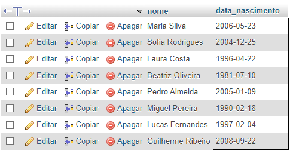
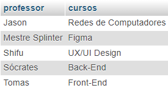

### ETAPA 1


## Criação do banco *tecinternet_escola_seunome**

### ETAPA 2

## Tabela cursos, professores e alunos
```SQL
CREATE TABLE cursos(
    id INT NOT NULL PRIMARY KEY AUTO_INCREMENT,
    titulo VARCHAR(30) NOT NULL
    carga_horaria TINYINT NOT NULL,
    professor_id TINYINT  NULL
);
```

```SQL
CREATE TABLE professores(
    id TINYINT NOT NULL PRIMARY KEY AUTO_INCREMENT,
    nome VARCHAR(50) NOT NULL,
   	area_atuacao ENUM('design', 'desenvolvimento', 'infra') NOT NULL, 
    carga_horaria TINYINT NOT NULL,
    curso_id TINYINT NOT NULL
);
```

```SQL
CREATE TABLE alunos(
    id TINYINT NOT NULL PRIMARY KEY AUTO_INCREMENT,
    nome VARCHAR(50) NOT NULL,
    data_nascimento DATE NOT NULL,
    nota_um DECIMAL(4,2),
    nota_dois DECIMAL(4,2),
    curso_id TINYINT NOT NULL,
    CONSTRAINT fk_cursos FOREIGN KEY (curso_id)  REFERENCES cursos(id)
);
```

## Chaves estrangeiras

# Índices para tabela `alunos`

ALTER TABLE `alunos`
  ADD PRIMARY KEY (`id`),
  ADD KEY `fk_cursos_alunos` (`curso_id`);


# Índices para tabela `cursos`

ALTER TABLE `cursos`
  ADD PRIMARY KEY (`id`),
  ADD KEY `fk_cursos_professores` (`professor_id`);


# Índices para tabela `professores`

ALTER TABLE `professores`
  ADD PRIMARY KEY (`id`);


##  Adicionando Cursos

```SQL
INSERT INTO `cursos` (`id`, `titulo`, `carga_horaria`, `professor_id`) VALUES
(1, 'Front-End', 40, 5),
(2, 'Back-End', 80, 4),
(3, 'UX/UI Design', 30, 3),
(4, 'Figma', 10, 2),
(5, 'Redes de Computadores', 100, 1);
```


## Adicionando os Professores

```SQL
INSERT INTO `professores` (`id`, `nome`, `area_atuacao`, `curso_id`) VALUES
(1, 'Jason', 'infra', 5),
(2, 'Mestre Splinter', 'design', 4),
(3, 'Shifu', 'design', 3),
(4, 'Sócrates', 'desenvolvimento', 2),
(5, 'Tomas', 'desenvolvimento', 1);
```


## Adicionando Alunos

```SQL
INSERT INTO `alunos` (`id`, `nome`, `data_nascimento`, `nota_um`, `nota_dois`, `curso_id`) VALUES
(4, 'Maria Silva', '0000-00-00', 8.00, 9.00, 1),
(5, 'Ana Santos', '0000-00-00', 7.00, 6.00, 2),
(6, 'Sofia Rodrigues', '0000-00-00', 9.00, 10.00, 3),
(7, 'Laura Costa', '0000-00-00', 6.00, 7.00, 4),
(8, 'Beatriz Oliveira', '0000-00-00', 9.00, 8.00, 5),
(9, 'João Santos', '0000-00-00', 5.00, 9.00, 5),
(10, 'Pedro Almeida', '0000-00-00', 8.00, 9.00, 4),
(11, 'Miguel Pereira', '0000-00-00', 5.00, 6.00, 3),
(12, 'Lucas Fernandes', '0000-00-00', 7.00, 6.00, 2),
(13, 'Guilherme Ribeiro', '0000-00-00', 6.00, 5.00, 1);
```


### ETAPA 3

## 01 Consulta de alunos que nasceram antes de 2009

```SQL
 select nome, data_nascimento from alunos where data_nascimento < '2009-01-01';
```




## 02 Consulta de média dos alunos e apresentar com duas casas decimais.

```SQL
SELECT
    nome AS Nome,
    CAST(((nota_um + nota_dois) / 2) AS DEC(6, 2)) AS Média
FROM alunos;
```


## 03 Calculo de possiveis faltas de cada curso

```SQL
SELECT titulo, ROUND(carga_horaria * 0.25) AS 'Limite de Faltas'
FROM cursos ORDER BY titulo ASC;
```

## 04 Consulta de professores da área de desenvolvimento

```SQL
 select nome, area_atuacao from professores where area_atuacao.quantidade = 'desenvolvimento';
```


## 05 Consulta quantidade de professores de cada área

```SQL
SELECT area_atuacao AS 'área de Atuação', COUNT(*) AS 'QTD de Docentes'
FROM professores GROUP BY area_atuacao;
```

## 06 consulta que mostre o nome dos alunos, o título e a carga horária dos cursos que fazem.

```SQL
SELECT
    alunos.nome as aluno,
    ROUND(carga_horaria * 0.25) AS 'Limite de Faltas',
    cursos.titulo as cursos
    FROM alunos INNER JOIN cursos
    ON alunos.curso_id = cursos.id;
```


## 07 consulta que mostre o nome dos professores e o título do curso que lecionam. Classifique pelo nome do professor.

```SQL
SELECT 
    professores.nome as professor,
    cursos.titulo as cursos
    FROM professores INNER JOIN cursos
    ON professores.curso_id = cursos.id
    ORDER BY professores.nome ASC;
```



## 08 consulta que mostre o nome dos alunos, o título dos cursos que fazem, e o professor de cada curso.

```SQL
SELECT alunos.nome AS Alunos, cursos.titulo AS Cursos, professores.nome AS Professores
FROM alunos INNER JOIN cursos
ON alunos.curso_id = cursos.id
INNER JOIN professores 
ON cursos.professor_id = professores.id
```

## 09 consulta que mostre a quantidade de alunos que cada curso possui. Ordem Decrescente

```SQL
SELECT
cursos.titulo AS Cursos,
COUNT(alunos.curso_id) AS "QTD de Alunos"
FROM cursos INNER JOIN alunos
ON alunos.curso_id = cursos.id
GROUP BY alunos.curso_id
ORDER BY Cursos DESC;
```

## 10 Consulta nome do aluno, suas notas, médias, do curso de Front e Back-end em ordem alfabética

```SQL
SELECT alunos.nome AS Alunos, alunos.nota_um AS 'Primeira Nota', alunos.nota_dois AS 'Segunda Nota', ROUND(AVG((alunos.nota_um + alunos.nota_dois) / 2), 2) As 'Média dos Alunos',   cursos.titulo AS Cursos
FROM alunos INNER JOIN cursos
ON alunos.curso_id = cursos.id
WHERE cursos.titulo LIKE '%Front_End%' OR cursos.titulo LIKE '%Back_End%'
GROUP BY alunos.nome;
```


## 11 consulta que altere o nome do curso de Figma para Adobe XD e sua carga horária de 10 para 15.

```SQL
UPDATE cursos
SET titulo = 'Adobe XD', carga_horaria = 15
WHERE id = 4
AND id = (SELECT id FROM cursos WHERE id = 4);
```

## 12 consulta que exclua um aluno do curso de Redes de Computadores e um aluno do curso de UX/UI.

```SQL
DELETE FROM alunos
WHERE id = 9 AND id= 6;
```
## 13 consulta que mostre a lista de alunos atualizada e o título dos cursos que fazem, classificados pelo nome do aluno.

```SQL
SELECT alunos.nome AS Alunos, cursos.titulo AS Cursos
FROM alunos INNER JOIN cursos
ON alunos.curso_id = cursos.id
GROUP BY Alunos;
```

